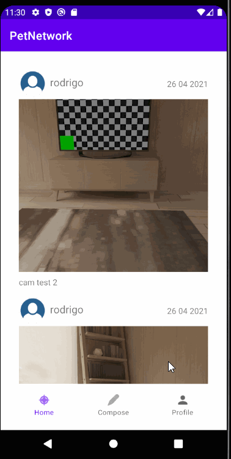

Original App Design Project - README
===
#     Pet Network

## Table of Contents
1. [Overview](#Overview)
1. [Product Spec](#Product-Spec)
1. [Wireframes](#Wireframes)
2. [Schema](#Schema)

## Overview
### Description
Pairs a user's animal with similar animals in the area. Allows the users to message each other and set up playdates. Users can also post pictures from the playdate.

### App Evaluation
[Evaluation of your app across the following attributes]
- **Category:** Social Networking
- **Mobile:** This app will be developed primarily for mobile devices. Users are able to use the camera to take pictures and location to find other users near them.
- **Story:** Locates pets in a particular area and recommends them. The user can then message other users to meet up.
- **Market:** Any individual with a pet.
- **Habit:** The app could be used as often as the user desires.
- **Scope:** First, pets will be matched based on pet type and location. It can then include messaging between users and the ability to post pictures.

## Product Spec

### 1. User Stories (Required and Optional)

**Required Must-have Stories**

* User logs in to access pet profile information
* User sees feed of other pets with information such as pet name, pet location, pet type, etc.
* User sees screen with pet profile which includes the pet's information
* User can take and post pictures to their accounts
* User can click on another user's profile

**Optional Nice-to-have Stories**

* User can message other pet owners using a message button
* Message button is available after clicking on another user's profile

### 2. Screen Archetypes

* Login 
* Register - User signs up or logs into their account
* Feed Screen
* Profile Screen
* Settings Screen

### 3. Navigation

**Tab Navigation** (Tab to Screen)

* Login / Logout
* Profile
* Feed
* Message

**Flow Navigation** (Screen to Screen)

* Login / Logout
   * User enter with login user and password
   * If you don't have an account, go to the page to create a profile
* Profile
   * User can modify it
* Feed
    * User can scrolldown to see more
    * User can navigate into a post to see more details about it
    * User can jump to message 
* Message
    * User can post text, photo or videos about your pet 

## Wireframes

### [BONUS] Digital Wireframes & Mockups

### [BONUS] Interactive Prototype

## Schema 

### Models

#### Post

   |Property|Type|Description|
   |---|---|---|
   |author|Pointer to User|User that uploaded the post|
   |image|File|Image that user posts|
   |caption|String|Caption for the image|
   |createdAt|DateTime|Time and date when post is created|
   |location|String|City where user is located|
   

### Networking
- Home feed screen 
    - (Read/GET) Query all posts
    CODE SNIPPET...
public class ProfileFragment extends PostsFragment{
    @Override
    protected void queryPosts() {
        ParseQuery<Post> query = ParseQuery.getQuery(Post.class);
        query.include(Post.KEY_USER);
        query.whereEqualTo(Post.KEY_USER, ParseUser.getCurrentUser());
        query.setLimit(20);
        query.addDescendingOrder(Post.KEY_CREATED_KEY);
        
- Create Post screen 
    - (Create/POST) Create a new post object
- Profile screen-
    - (Read/GET) all posts that belong to current user

GIF

